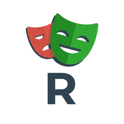

# Playwright CodeLens Runner

<p align="center">
  
</p>

Run, debug, inspect, and open Playwright tests in UI mode directly from the editor line where each test is declared.

Version 3.3 adds normal Companion Runs, real-time sidebar test execution tracking, replace-on-rerun UI/Inspector sessions, and an optional managed Runs dashboard while retaining companion Flake Lab runs, artifacts, advanced UI workflows, and configurable CodeLens actions.

Playwright CodeLens Runner is a CodeLens companion to [Playwright Test for VS Code](https://marketplace.visualstudio.com/items?itemName=ms-playwright.playwright). Microsoft's official extension remains the only native test provider; this extension adds convenient CodeLens actions and carefully scoped Playwright CLI tools.

## CodeLens at a glance

```text
Run File · Debug File · Playwright UI · CLI Config: playwright.config.ts · More…

Run Suite · Debug Suite · Inspect Suite · Playwright UI · More…
test.describe('checkout', () => {

  Run Test · Debug Test · Inspect Test · Playwright UI · More…
  test('submits an order', async ({ page }) => {
```

The CodeLens workbench supports three layouts:

- `full` keeps the complete action sets. Files also show the resolved **CLI Config**, and generated tests show **Cases (N)…**.
- `compact` shows `Run · Debug · More…`; CLI config selection, Inspector/UI, and generated cases remain available inside **More…**.
- `custom` uses separate `codeLens.fileActions`, `codeLens.suiteActions`, and `codeLens.testActions` arrays. The file-only `config` action and generated-test-only `cases` action are configurable too.

For example:

```json
{
  "playwrightCodeLensRunner.codeLens.layout": "custom",
  "playwrightCodeLensRunner.codeLens.fileActions": ["run", "debug", "config", "more"],
  "playwrightCodeLensRunner.codeLens.suiteActions": ["run", "inspect", "ui"],
  "playwrightCodeLensRunner.codeLens.testActions": ["run", "debug", "inspect", "cases", "more"]
}
```

Loop-generated tests remain one declaration. Microsoft Testing Run/Debug and the declaration's direct Inspector/UI actions target all generated cases at that source line. **Cases (N)…** lets you choose one exact case for Inspector or UI, combining the declaration line with file- and title-boundary-aware filtering.

| Action | Execution owner | Result location |
| --- | --- | --- |
| Run / Debug | Microsoft Playwright extension | VS Code Testing, gutter, output, duration, and debugger |
| Inspect | Playwright CodeLens Runner | Playwright Inspector and an integrated terminal |
| Playwright UI | Playwright CodeLens Runner | Playwright UI and an integrated terminal |

## Companion Runs, Flake Lab, and sidebar dashboard

**Run Companion Test (Normal CLI Run)** is an extension-owned Playwright CLI execution available via **More…** and Command Palette (`playwrightCodeLensRunner.runCompanion`). It runs tests with target-scoped arguments without native VS Code test run duplication and without Flake Lab's repeating overhead.

**Flake Lab** is a companion CLI run for the current file, suite, test, or generated-case declaration. It deliberately does not create a native VS Code test run. By default it uses `--repeat-each 10`, `--workers 1`, `--retries 1`, `--trace on`, and `--fail-on-flaky-tests`; the last flag requires Playwright Test 1.52 or later.

The **Playwright Runs** sidebar retains the latest companion summary, its totals and failures, and tracks each Playwright worker from exact test start/end events. Concurrent runs show completed and active counts (for example, `3/10 completed · 5 running`), while each finished test receives its result immediately without changing the status of tests that are still running. Flake Lab keeps one row per source test and aggregates its repetitions into live completed/running counts and final clean, flaky, failed, or skipped outcomes. The view also provides **Rerun Failed** and links back to Microsoft Testing for native results. Set `playwrightCodeLensRunner.sidebar.runsEnabled` to `false` to hide this managed Runs view and launch Companion runs, Flake Lab, or cached failed-test reruns directly in an integrated terminal instead. Terminal-only runs use the generated Playwright arguments without the managed reporters or summary updates; the Artifacts view remains available.

The companion’s **More…** menu also provides changed and last-failed Playwright UI launches, discovered-tag actions, UI profiles, and Artifact Center. **Open Changed Tests in Playwright UI** uses `--only-changed` for uncommitted changes by default or a supplied Git ref; **Open Last Failed Tests in Playwright UI** uses Playwright’s persisted last-run data. These are target-scoped: they preserve the resolved config and selected companion projects without adding the current test title filter.

Tag actions use discovered `@tags` and structured `--grep @tag` arguments for UI, Inspector, and copied terminal commands. The extension keeps one global UI/Inspector terminal: launching any new interactive action cancels the current Playwright UI or Inspector session before starting the requested target or profile.

### Artifacts and remote UI

The **Playwright Artifacts** view scans only configured target directories and the local `playwright-report`, `blob-report`, and `test-results` roots by default. It ranks HTML reports, report ZIPs, traces, blob-report ZIPs, and test-result attachments newest-first. Open or reveal artifacts from the view, merge blob reports with `playwright merge-reports --reporter html`, and reopen the generated report.

Remote UI profiles add `--ui-host` and `--ui-port` safely as CLI arguments:

```json
{
  "playwrightCodeLensRunner.ui.profiles": [
    { "name": "Codespaces", "host": "0.0.0.0", "port": 8080 }
  ],
  "playwrightCodeLensRunner.ui.defaultProfile": "Codespaces"
}
```

Non-loopback profiles display a network-exposure warning before launch. The extension focuses its companion view after companion actions and Microsoft Testing after native Run/Debug by default; set `playwrightCodeLensRunner.sidebar.autoFocus` to `false` to opt out. View placement remains entirely under VS Code and user control.

Run and Debug delegate to VS Code Testing, so editor actions update the same Microsoft-owned test results as the Testing view. Inspector and UI intentionally remain standalone CLI sessions and do not create duplicate native test runs.

## Why use it

- Run or debug a file, suite, or test without leaving the editor.
- Open an exact suite or test in Playwright Inspector or Playwright UI.
- Keep Microsoft as the sole `TestController`, avoiding duplicate execution and competing results.
- Discover nested suites, top-level tests, duplicate titles, and data-driven cases through Playwright itself.
- Collapse loop-generated cases at one source declaration into one CodeLens group.
- Select one exact generated case for Inspector or Playwright UI without changing native Run/Debug scope.
- Work across multiple configs, workspace roots, cross-root `testDir` ownership, and nested monorepo packages.
- Show discovery failures in the editor with Details, Retry, and CLI-config recovery actions.
- Resolve overlapping CLI config ownership without interrupting CodeLens calculation, remember explicit choices per file, and display the active CLI config in the file lens.
- Preserve config, working directory, environment, extra options, and paths containing spaces.
- Choose companion CLI projects independently from Microsoft's private project selection.

## Requirements

- VS Code 1.125 or newer on the extension host
- [Playwright Test for VS Code](https://marketplace.visualstudio.com/items?itemName=ms-playwright.playwright), installed automatically as an extension dependency. This extension is validated against the latest published official release, `1.1.19`, and remains pinned to it in the test matrix.
- Node.js 22.13 or newer for contributors; Node.js 24 LTS is recommended. The extension host runtime itself is provided by VS Code.
- `@playwright/test` 1.38 or newer in the workspace or a parent package root
- A trusted workspace, because Playwright discovery and CLI tools execute workspace configuration and test code

## Getting started

1. Install **Playwright CodeLens Runner**. VS Code also installs Microsoft's required Playwright extension.
2. Open a trusted workspace containing a Playwright config or test file.
3. Configure native projects and browsers in Microsoft's Testing view.
4. Open a `*.spec.*` or `*.test.*` file and use its CodeLens actions.
5. Optionally run **Playwright: Configure CLI Projects** for Inspector and Playwright UI.

Conventional `playwright*.config.{js,cjs,mjs,ts,cts,mts}` files are discovered automatically, including variants such as `playwright.no-db.config.ts` and `playwright.pdf.config.ts`. For any other filename, list it explicitly in `playwrightCodeLensRunner.configFiles`. Custom test patterns, configless workspaces, multi-root workspaces, and nested monorepos are also supported.

Companion discovery, Inspector, and UI use cwd-relative paths when possible, otherwise absolute paths, then forward-slash-normalize and regex-escape Playwright's positional file filter. This keeps every CLI action reliable for filenames containing spaces or regular-expression metacharacters and for Windows-style paths.

Suite and test Inspector/UI actions combine that file filter with the declaration's source line and an exact title-path filter. The line scope distinguishes title paths that Playwright flattens to the same text, while the title filter accepts project prefixes, nested-file paths, separators, and inherited tags.

## Inspector browser

Inspector follows the Playwright config and configured CLI projects by default. To force one browser only for **Inspect Test/Suite**, set:

```json
{
  "playwrightCodeLensRunner.inspector.browser": "firefox"
}
```

Available values are `config`, `chromium`, `firefox`, and `webkit`.

- `config` preserves Playwright config behavior and **Configure CLI Projects** selections.
- With named config projects, a forced browser selects the same-named project.
- When no projects are defined, the extension uses Playwright's `--browser` option.
- If projects use custom names, keep `config` and select them through **Configure CLI Projects**.

This setting affects Inspector only. It does not change Playwright UI or Microsoft-owned Run/Debug behavior.

## Project ownership

Microsoft's enabled configs and projects are private to the official extension and control native Run/Debug. Playwright CodeLens Runner never reads Microsoft internals.

**Configure CLI Projects** stores a separate project selection for Inspector and Playwright UI. This separation is intentional: changing companion CLI projects cannot silently alter the official Testing view.

The **CLI Config** file lens is also companion-only. CodeLens resolves ownership noninteractively: it revalidates a remembered choice, otherwise selects a deterministic config whose Playwright discovery owns the file. Use **Select CLI Config for File** to choose another overlapping config and remember it for that file. Configs may own sibling directories or tests in another workspace root; they do not need to be ancestors of the test file.

Saved and externally changed test/config files invalidate affected discovery caches. Known persisted or discovered owners are refreshed together, so cross-root and sibling layouts do not go stale after generators, Git operations, or edits outside VS Code.

## Commands

Open the Command Palette and search for **Playwright**:

- **Refresh Tests**
- **Configure CLI Projects**
- **Open Microsoft Playwright Settings**
- **Run Test** / **Debug Test**
- **Run All Tests in File** / **Debug All Tests in File**
- **Run Test with Playwright Inspector**
- **Open in Playwright UI**
- **More Playwright Actions…** / **Pick an Exact Generated Case**
- **Show Playwright Discovery Details** / **Retry Playwright Discovery**
- **Select CLI Config for Current File** — run this from Command Palette (`Cmd+Shift+P`) to choose and remember the companion CLI config for the active file
- **Rerun Last Run**
- **Run Flake Lab** / **Rerun Failed Companion Tests**
- **Open Changed Tests in Playwright UI** / **Open Last Failed Tests in Playwright UI**
- **Tag Actions…** / **Open Playwright UI Profile…**
- **Open Playwright Runs** / **Open Playwright Artifact Center**
- **Open Latest Playwright Report** / **Open Latest Playwright Trace** / **Merge Playwright Blob Reports**
- **Show HTML Report** / **Show Trace**
- **Record New Test (Codegen)**

Refresh and Rerun delegate to VS Code Testing. Report, trace, codegen, Inspector, and UI use the resolved workspace Playwright CLI.

Discovery Details and Retry preserve file scope only when the active document matches `playwrightCodeLensRunner.codeLens.pattern`; otherwise they ask for a CLI config. Diagnostics include scope, config, working directory, CLI version, projects, duration, and a shell-quoted command preview; sensitive option values and configured environment values are redacted.

## Settings

All commands and settings live in the `playwrightCodeLensRunner.*` namespace. Version 3.3 continues the clean break from earlier `playwrightrunner.*` and `playwrightCliRunner.*` identifiers: they are no longer read, aliased, or migrated. Update any workspace configuration to the namespace below.

| Setting | Purpose | Default |
| --- | --- | --- |
| `playwrightCodeLensRunner.configFiles` | Explicit discovery/CLI config paths; empty discovers conventional `playwright*.config.*` files | `[]` |
| `playwrightCodeLensRunner.cli.executable` | Explicit CLI executable such as `npx`, `pnpm`, or a local binary | automatic |
| `playwrightCodeLensRunner.cli.arguments` | Arguments inserted before the Playwright subcommand | `[]` |
| `playwrightCodeLensRunner.workingDirectory` | Companion CLI working directory | config directory |
| `playwrightCodeLensRunner.runOptions` | Extra Inspector and Playwright UI options | `[]` |
| `playwrightCodeLensRunner.inspector.browser` | Inspector browser/project override | `config` |
| `playwrightCodeLensRunner.environment` | Environment for discovery and CLI processes | `{}` |
| `playwrightCodeLensRunner.flakeLab.repeatEach` | Repetitions for companion Flake Lab runs | `10` |
| `playwrightCodeLensRunner.flakeLab.workers` | Workers for companion Flake Lab runs | `1` |
| `playwrightCodeLensRunner.flakeLab.retries` | Flake Lab retry count (`0`–`5`) | `1` |
| `playwrightCodeLensRunner.flakeLab.trace` | Trace mode for Flake Lab | `on` |
| `playwrightCodeLensRunner.flakeLab.failOnFlakyTests` | Fail a Flake Lab run when a retry recovers | `true` |
| `playwrightCodeLensRunner.ui.profiles` | Named remote UI host/port profiles | `[]` |
| `playwrightCodeLensRunner.ui.defaultProfile` | Profile used for normal UI actions | empty |
| `playwrightCodeLensRunner.sidebar.autoFocus` | Focus the action owner’s view | `true` |
| `playwrightCodeLensRunner.sidebar.runsEnabled` | Capture companion run summaries in the Runs sidebar; disable for terminal-only execution | `true` |
| `playwrightCodeLensRunner.artifacts.scanDirectories` | Local artifact roots per target | `playwright-report`, `blob-report`, `test-results` |
| `playwrightCodeLensRunner.codeLens.enabled` | Enable editor actions | `true` |
| `playwrightCodeLensRunner.codeLens.pattern` | Files receiving CodeLens actions | `**/*.{test,spec}.{js,jsx,ts,tsx,mjs,cjs,mts,cts}` |
| `playwrightCodeLensRunner.codeLens.layout` | `full`, `compact`, or `custom` CodeLens layout | `full` |
| `playwrightCodeLensRunner.codeLens.fileActions` | Custom file actions: `run`, `debug`, `ui`, `config`, `more` | `run`, `debug`, `ui`, `config` |
| `playwrightCodeLensRunner.codeLens.suiteActions` | Custom actions for suite lenses | `run`, `debug`, `inspect`, `ui` |
| `playwrightCodeLensRunner.codeLens.testActions` | Custom test actions, including generated-only `cases` | `run`, `debug`, `inspect`, `ui`, `cases` |

Paths and environment values support `${workspaceFolder}`, `${packageRoot}`, and `${configDir}`. These companion settings do not override Microsoft's native Run/Debug configuration.

## Marketplace identity

The marketplace identity is `rungruch.playwright-codelens-runner`. If an earlier development VSIX is installed under `rungruch.playwright-cli-test-runner`, uninstall it before installing this package.

## Development

Contributors need Node.js 22.13 or newer (Node.js 24 LTS recommended).

```sh
npm ci
npm run test:fixture
npm run typecheck      # TypeScript 7
npm run typecheck:ts6  # TypeScript 6 parity (temporary)
npm run lint           # ESLint, zero warnings allowed
npm run check:unused   # Knip
npm run test:reporter  # Reporter compatibility against supported Playwright fixtures
npm test
npm run package
npm run vsix
```

### TypeScript 7 and TypeScript 6 side by side

[TypeScript 7 does not yet expose the compiler API](https://devblogs.microsoft.com/typescript/announcing-typescript-7-0/) that tools such as typescript-eslint require. The repository therefore follows Microsoft's documented side-by-side arrangement: native TypeScript 7 is the primary compiler for builds and type-checking, while TypeScript 6 is available only for tooling compatibility.

```json
{
  "devDependencies": {
    "@typescript/native": "npm:typescript@^7.0.2",
    "typescript": "npm:@typescript/typescript6@^6.0.2"
  }
}
```

`npm run typecheck` resolves `tsc` from TypeScript 7. `npm run typecheck:ts6` runs `tsc6` from the compatibility package as a temporary parity gate. TypeScript 6 can be removed once typescript-eslint supports native TypeScript 7.

### Test matrix

Extension-host tests install `ms-playwright.playwright@1.1.19` and run against browserless fixtures:

| Suite | Host | Fixture |
| --- | --- | --- |
| Full basic fixture | Earliest tested VS Code 1.125 patch (`1.125.1`) | `fixtures/basic` (Playwright `1.62.1`) |
| Full basic fixture | Current stable VS Code `1.132.0` | `fixtures/basic` (Playwright `1.62.1`) |
| Playwright compatibility smoke | Earliest tested VS Code 1.125 patch (`1.125.1`) | `fixtures/pw138` (Playwright `1.38.0`) |
| Multi-root ownership and discovery | Earliest tested VS Code 1.125 patch (`1.125.1`) | `fixtures/multipkg` with overlapping, sibling-`testDir`, and cross-root configs (Playwright `1.62.1`) |

Playwright `1.38.0` remains the supported minimum despite newer maintained fixtures. The official Playwright extension remains pinned at its latest published release, `1.1.19`, in these tests.

### Intentional dependency pins

`npx --package npm-check-updates ncu` is rerun after upgrades. The following pins are deliberate rather than stale:

- `@types/node` stays on 22 so declarations match the VS Code extension host runtime, not the latest major (26).
- `@types/vscode` matches the declared engine floor (`1.125.0`).
- `typescript` aliases TypeScript 6 solely for the compiler API; `@typescript/native` aliases TypeScript 7 for `tsc`.
- `fixtures/pw138` keeps `@playwright/test` pinned to `1.38.0` to exercise the compatibility floor.

## Thanks

This project began as a fork of [sakamoto66/vscode-playwright-test-runner](https://github.com/sakamoto66/vscode-playwright-test-runner). Thank you to Sakamoto and the original project's contributors for the foundation that made this rework possible.

## License

[MIT](LICENSE)
